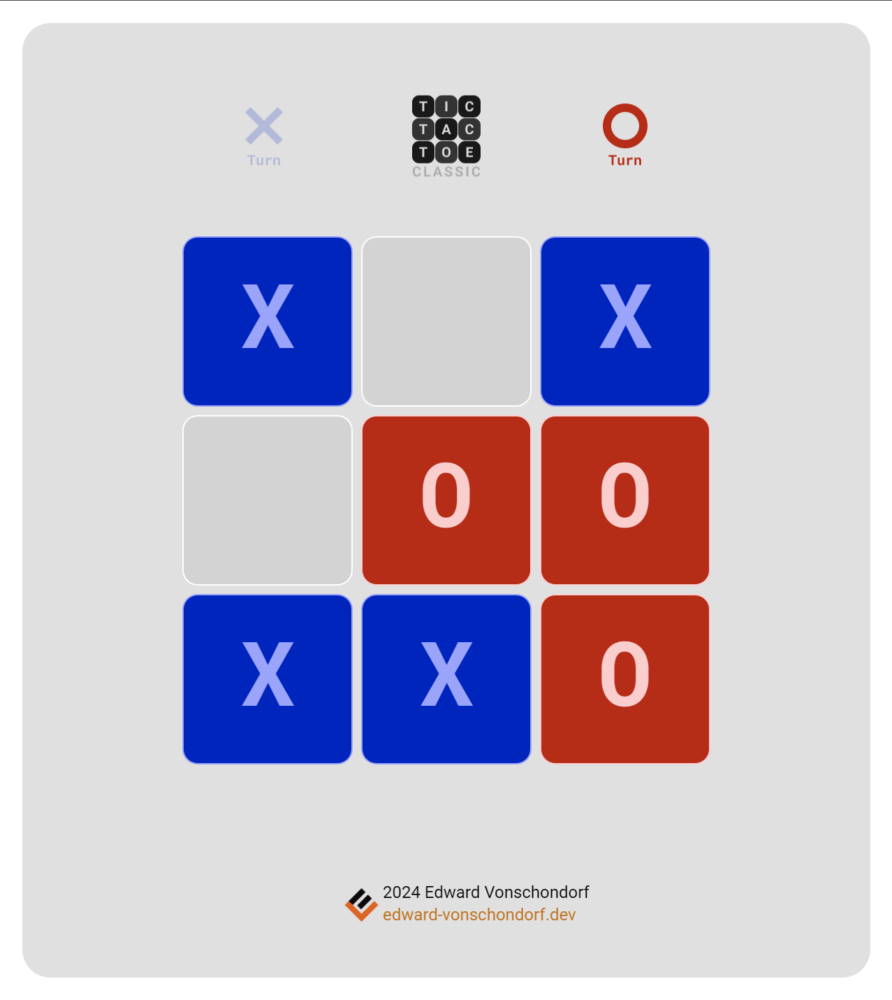

# Tic Tac Toe Classic
A JavaScript implementation of the classic game Tic Tac Toe using the HTML5 canvas element.

## Features
- Play classic Tic Tac Toe on a 3x3 grid
- Play against a friend (locally)
- Playable with mouse or touch enabled devices.

## Play Now

[Coming Soon](https://github.com/Torvec/tic-tac-toe-classic)

### Notes

- This project originally started in my other repository [Tic-Tac-Toe](https://github.com/Torvec/tic-tac-toe) that I decided to split into two separate projects. The other is the Ultimate Tic Tac Toe game which can be found here: [Ultimate Tic Tac Toe](https://github.com/Torvec/tic-tac-toe-ultimate)